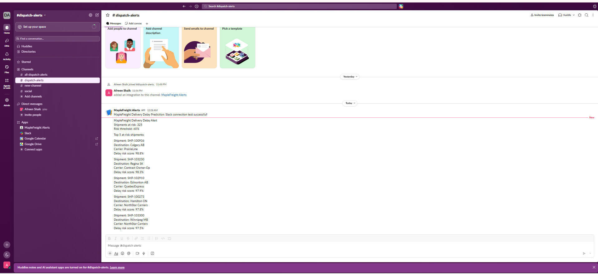

# MapleFreight Delivery Delay Prediction & Slack Alerts

## 1. Project Overview

This project focuses on predicting late deliveries for MapleFreight Logistics using machine learning.

MapleFreight handles shipments across Ontario, Quebec and the Prairies. Late deliveries can affect customer satisfaction and increase operational costs.

The goal of this project is to identify shipments that may be delivered late and send alerts to the dispatch team through Slack so they can take action earlier.

I used Python in VS Code to clean and explore the dataset, train machine learning models, evaluate their performance and connect the prediction results to Slack.

## 2. Problem Statement

MapleFreight needs a way to identify shipments that are at risk of arriving late.

Without an early warning system, the dispatch team may not notice potential delays until they have already affected delivery schedules.

This project uses historical shipment data to predict late deliveries and demonstrate how these predictions can be shared through Slack.

## 3. Project Objectives

The main objectives of this project are:

- Understand and explore the MapleFreight shipment dataset.
- Clean missing, duplicate and inconsistent data.
- Create useful features for predicting delivery delays.
- Train and compare two machine learning models.
- Evaluate precision, recall, F1 score and confusion matrices.
- Select a suitable probability threshold for delay alerts.
- Identify the features influencing model predictions.
- Send actual prediction alerts to a Slack channel.

## 4. Dataset Description

The dataset used in this project is `maplefreight_delivery_delay_dataset.csv`.

The original dataset contained:

- **6,035 shipment records**
- **23 columns**
- **Target variable:** `delivered_late`

The target variable indicates whether a shipment was delivered late:

- `0` – Delivered on time
- `1` – Delivered late

The dataset contains information about shipment routes, carriers, service levels, weather, traffic, delivery schedules and other shipment details.

Approximately 21% of the original shipments were late, meaning the dataset has an imbalance between on-time and late deliveries.

## 5. Data Cleaning and Preprocessing

Before training the models, I checked the dataset for missing values, duplicate records, inconsistent categories and incorrect numerical values.

The cleaning process included:

- Removing 32 exact duplicate records.
- Standardizing inconsistent service level names.
- Correcting 40 shipment weights that appeared to be recorded in grams instead of kilograms.
- Checking repeated shipment IDs.
- Removing conflicting shipment records and keeping one copy of identical records.
- Preparing missing values for imputation during model training.

After cleaning, the dataset contained **5,999 shipment records with no repeated shipment IDs**.

Missing numerical values were handled using median imputation, while missing categorical values were handled using the most frequent category.

These transformations were included in the machine learning pipeline to avoid using information from the test dataset during training.

## 6. Exploratory Data Analysis

I explored the dataset to understand delivery patterns and identify factors that might be related to late shipments.

The analysis included:

- Comparing on-time and late deliveries.
- Examining delivery delays across different carriers.
- Comparing late delivery rates across service levels.
- Exploring the relationship between weather conditions and delivery delays.

This helped me understand the dataset before building the prediction models.

## 7. Feature Engineering

I created three additional features:

**Distance per hour:** Calculated by dividing shipment distance by scheduled transit hours. This helps describe how demanding the delivery schedule may be.

**Pickup late:** Indicates whether the shipment experienced a pickup delay.

**Stops per 100 km:** Calculates the number of stops relative to the shipment distance.

These features were added to provide more information about shipment schedules and route conditions.

The `shipment_id` column was excluded from model training because it is an identifier.

The `actual_transit_hours` column was also excluded because it is only known after delivery and would cause data leakage.

The prediction workflow assumes the required input information is available after pickup, when pickup delay information is known.

## 8. Data Preparation

I separated the dataset into input features and the target variable.

The data was divided into:

- **Training data:** 4,799 records (80%)
- **Testing data:** 1,200 records (20%)

I used a stratified train-test split to maintain a similar proportion of late deliveries in both datasets.

The preprocessing pipeline included:

- Median imputation for missing numerical values.
- Most-frequent imputation for missing categorical values.
- StandardScaler for numerical features.
- OneHotEncoder for categorical features.

The final model inputs contained 23 features before categorical encoding.

## 9. Machine Learning Models

I trained two machine learning models.

### Logistic Regression

Logistic Regression was used as the baseline model.

I used `class_weight="balanced"` because the dataset contained fewer late deliveries than on-time deliveries.

### Random Forest

Random Forest was used as the comparison model.

It can learn more complex relationships between shipment features and delivery outcomes.

Both models were trained using the same training and testing datasets.

## 10. Model Evaluation Results

I evaluated both models using precision, recall, F1 score and confusion matrices.

| Model | Precision | Recall | F1 Score |
|---|---:|---:|---:|
| Logistic Regression | 0.417 | 0.737 | 0.533 |
| Random Forest | 0.613 | 0.372 | 0.463 |

### Logistic Regression Results

- Correctly identified late deliveries: 182
- Missed late deliveries: 65
- False alerts: 254

### Random Forest Results

- Correctly identified late deliveries: 92
- Missed late deliveries: 155
- False alerts: 58

### Model Selection

I selected **Logistic Regression** for the alert system because it identified more actual late deliveries than Random Forest.

Random Forest had better precision and produced fewer false alerts, but it missed significantly more delayed shipments.

For MapleFreight, identifying potential delays is important because the dispatch team needs enough time to respond.

## 11. Probability Threshold Selection

I tested different probability thresholds to understand how they affected the number of alerts and missed deliveries.

| Threshold | Precision | Recall | F1 Score | False Alerts | Missed Delays |
|---|---:|---:|---:|---:|---:|
| 0.3 | 0.314 | 0.899 | 0.465 | 485 | 25 |
| 0.4 | 0.364 | 0.806 | 0.501 | 348 | 48 |
| 0.5 | 0.417 | 0.737 | 0.533 | 254 | 65 |
| 0.6 | 0.489 | 0.644 | 0.556 | 166 | 88 |
| 0.7 | 0.606 | 0.530 | 0.566 | 85 | 116 |

### Selected Threshold: 0.6

I selected a threshold of **0.6 (60%)** for the Slack alert system.

At this threshold:

- Precision: 48.9%
- Recall: 64.4%
- F1 Score: 55.6%
- False alerts: 166
- Missed late deliveries: 88

The threshold reduced false alerts compared with the default 0.5 threshold while still identifying a useful proportion of delayed shipments.

This is a starting point rather than a guaranteed optimal threshold. The dispatch team would need to review the trade-off between false alerts and missed deliveries before using the system in daily operations.

## 12. Model Explainability

I examined the Logistic Regression coefficients to understand which features influenced the predictions.

Some important features included:

- Weather conditions, especially storms.
- Carrier information.
- Shipment distance.
- Traffic levels.
- Number of stops.
- Service level.

Stormy weather, longer distances, heavier traffic and more stops were associated with higher predicted delay risk.

Clear weather was associated with lower predicted delay risk.

These results describe patterns learned by the model and do not prove that these factors directly cause delays.

## 13. Slack Integration

I connected the prediction model to Slack using an Incoming Webhook.

The Slack channel used for testing was `#dispatch-alerts`.

The webhook URL was stored securely in a local `.env` file and loaded into Python using `python-dotenv`.

I used the `requests` library to send messages to Slack.

### Alert Information

The Slack alert includes:

- Total number of shipments at risk.
- Selected probability threshold.
- Top five highest-risk shipments.
- Shipment IDs.
- Destination cities.
- Carrier names.
- Predicted delay risk scores.

### Slack Test Results

Using the Logistic Regression model and the 0.6 threshold, the system identified **325 at-risk shipments out of 1,200 test shipments**.

The alert was successfully posted to the `#dispatch-alerts` Slack channel.

The five highest-risk shipments were:

| Shipment ID | Destination | Carrier | Delay Risk |
|---|---|---|---:|
| SHP-100936 | Calgary AB | PrairieLine | 98.8% |
| SHP-103230 | Regina SK | Contract Owner-Op | 98.3% |
| SHP-102910 | Edmonton AB | QuebecExpress | 97.9% |
| SHP-100273 | Hamilton ON | NorthStar Carriers | 97.8% |
| SHP-103300 | Winnipeg MB | NorthStar Carriers | 97.5% |

These alerts were generated using historical test data to demonstrate the integration. The system is not yet connected to live shipment operations.

### Slack Alert Screenshot

The screenshot showing the successful Slack alert is saved at:

`screenshots/slack_alert.png`



## 14. Tools and Technologies

The following tools and libraries were used:

- **Python:** Programming language.
- **VS Code:** Development environment.
- **Jupyter Notebook:** Data analysis and model development.
- **pandas:** Data cleaning and manipulation.
- **NumPy:** Numerical operations.
- **Matplotlib:** Data visualization.
- **Seaborn:** Exploratory data visualization.
- **scikit-learn:** Preprocessing, model training and evaluation.
- **requests:** Sending HTTP requests to Slack.
- **python-dotenv:** Loading the Slack webhook securely.
- **Slack:** Receiving delivery-delay alerts.
- **GitHub:** Version control and project submission.

## 15. Project Structure

```text
Assignment-1/
│
├── MapleFreight_Delivery_Delay_Prediction.ipynb
├── maplefreight_delivery_delay_dataset.csv
├── README.md
├── requirements.txt
├── .gitignore
├── .env.example
│
└── screenshots/
    └── slack_alert.png
```

The local `.env` file contains the private Slack webhook URL and is excluded from GitHub.

The Python virtual environment `.venv` is also excluded from the repository.

## 16. How to Run the Project

### Step 1: Download the Project

Clone the GitHub repository or download the project files.

Open the project folder in VS Code.

### Step 2: Create a Python Virtual Environment

Open the VS Code terminal and run:

```powershell
python -m venv .venv
```

Activate the environment in Windows PowerShell:

```powershell
.\.venv\Scripts\Activate.ps1
```

If the virtual environment already exists, there is no need to create another one.

### Step 3: Install Required Libraries

Run:

```powershell
python -m pip install -r requirements.txt
```

### Step 4: Configure Slack

Create a Slack workspace and a channel named `#dispatch-alerts`.

Create a Slack app and enable Incoming Webhooks.

Create a `.env` file using `.env.example` as a guide.

Add your actual Slack webhook URL:

```dotenv
SLACK_WEBHOOK_URL=your_actual_slack_webhook_url
```

Keep this file private.

### Step 5: Run the Notebook

Open `MapleFreight_Delivery_Delay_Prediction.ipynb` in VS Code.

Select the Python virtual environment as the Jupyter kernel.

Run the notebook cells in order.

The notebook will:

1. Load and explore the dataset.
2. Clean the shipment data.
3. Create additional features.
4. Prepare training and testing data.
5. Train Logistic Regression and Random Forest.
6. Evaluate and compare the models.
7. Select a prediction threshold.
8. Explain the model predictions.
9. Send an alert to Slack.

**Note:** Running the Slack alert cell sends a real message to the configured Slack channel.

## 17. Security and Privacy

The Slack Incoming Webhook URL is stored in `.env` instead of being written directly in the notebook.

The `.gitignore` file prevents `.env` from being uploaded to GitHub.

The `.env.example` file contains only a placeholder so other users can understand how to configure the project.

The actual webhook URL should never be shared publicly.

## 18. Recommendations

Based on the project results, I recommend using Logistic Regression as the starting model for identifying shipments at risk of late delivery.

The dispatch team should prioritize high-risk shipments, particularly when weather conditions, traffic or route characteristics suggest possible delays.

I also recommend reviewing model performance regularly and adjusting the probability threshold based on operational feedback.

Before using the system in daily operations, MapleFreight should connect it to current shipment data and test its performance on new deliveries.

## 19. Project Limitations

This project has some limitations:

- The models were trained and evaluated using historical shipment data.
- The Slack integration was demonstrated using test records rather than live shipments.
- Some late deliveries are still missed by the selected model and threshold.
- The system can generate false alerts.
- Model performance may change when shipment conditions or operational patterns change.
- Additional testing is needed before operational deployment.

## 20. AI Assistance Disclosure

I used ChatGPT to help me understand the machine learning workflow, explain Python code and troubleshoot issues while completing this project.

One issue occurred when I tried to load the Slack webhook from my `.env` file. The initial suggested code returned `Webhook configured: False`. I checked the file location and configuration, corrected the setup and ran the code again until the webhook loaded successfully.

I tested the notebook code in VS Code, reviewed the model results and confirmed that the Slack alert was successfully delivered.

## 21. Conclusion

This project demonstrates how machine learning can help MapleFreight identify shipments that may be delivered late.

I cleaned and prepared the shipment dataset, created additional features and compared Logistic Regression with Random Forest.

Logistic Regression was selected because it identified more actual late deliveries. I then used a probability threshold of 0.6 to create a balance between detecting delays and reducing false alerts.

Finally, I connected the prediction results to Slack and successfully sent an alert containing 325 at-risk shipments from the test dataset.

The project demonstrates a working prototype of a delivery-delay prediction and alert system that could be improved further for real-world use.
